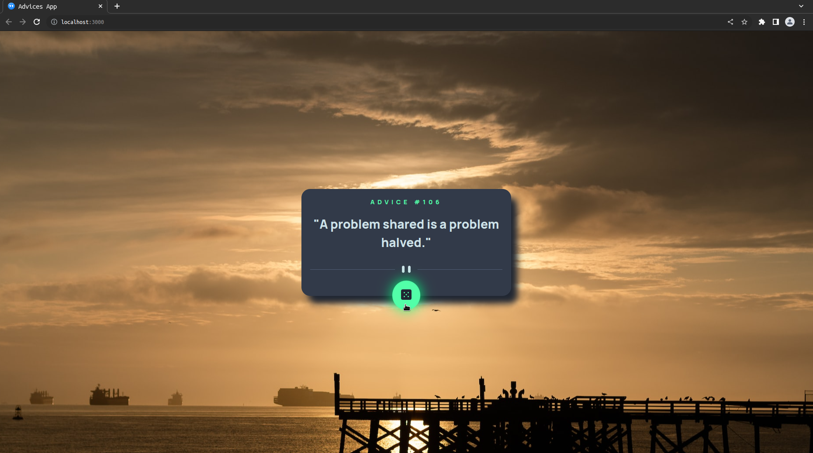
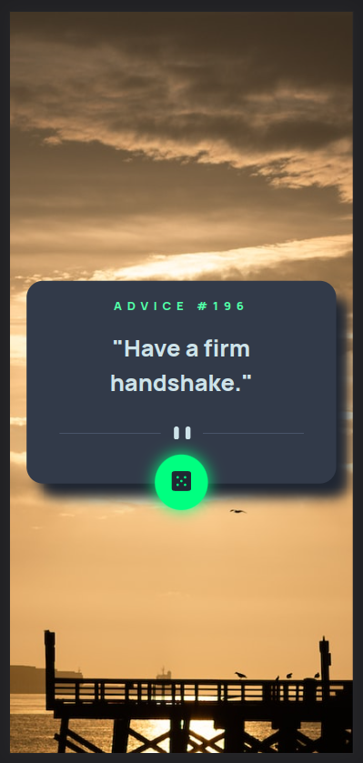

 

# Advice Generator App - Frontend Mentor

[src_assets_prints_advice.webm](https://user-images.githubusercontent.com/70491871/223278680-2571bcd0-e90e-4280-97e6-3a7ca3e73710.webm)

 

 

 

 

Este foi o quinto projeto da mentoria **Conquiste Sua Vaga**, o projeto que escolhi foi inspirado no desafio do Frontend Mentor que era a criação de um gerador de conselhos utilizando a API AdviceSlip.

## Sumário

- [Overview](#overview)
  - [O Desafio](#O-Desafio)
  - [Screenshot](#screenshot)
- [Meu processo](#Meu-processo)
  - [Stacks utilizadas](#Stacks-utilizadas)
  - [O que aprendi](#O-que-aprendi)
  - [Desenvolvimento Contínuo](#Desenvolvimento-Contínuo)
- [Author](#author)
- [Agradecimentos](#Agradecimentos)

## Overview

### O Desafio

- O desafio era criar um App Gerador de conselhos.

- Utilizar a API AdviceSlip para o conselhos

- Ver o layout ideal para a interface, dependendo do tamanho da tela do dispositivo

- Deixar o layout o mais próximo possível com o template do Desafio.

 

### **Screenshot - Desktop**

 

### **Screenshot - Mobile**

 

## Meu processo

- Selecionar o projeto a ser realizado

- Após selecionar o projeto e ter alguns problemas com a stack inicial, foram 3 mudanças até a stack que foi utilizada, optei por utilizar _HTML5, CSS, Javascript, React e Fetch_, sempre pensando em otimizar o desenvolvimento e aprendizado com a aplicação

- Foram realizados alguns wireframes de como seria toda a estrutura do projeto

- Recriei o template do Frontend Mentor usando o Figma, porém optei por fazer algumas alterções direto no código modificando um pouco o layout final.

- Iniciar o desenvolvimento do código na seguinte ordem, html, css e por último as funcionalidades javascript + react + fetch

### Stacks utilizadas

     

- [x] HTML5 Semântico
- [x] CSS
- [x] JavaScript
- [x] React
- [x] Fetch

### O que aprendi

- Refatorar o código para que ele ficasse menor, mais fácil de entender e optei por utilizar po fetch, evitando assim instalar uma lib para consumo de uma API com poucos dados de retorno.

- Aplicar o conceito de que menos é mais e que nem sempre precisamos componentizar tudo.

- Mudei um pouco o layout do desafio, adicionei uma imagem de fundo e um efeito de glowing no botão que chame a atenção do usuário e o leve a clicar no botão.

- Uma grande melhoria na gestão desse projeto ao utilizar o método pomodoro

### Desenvolvimento Contínuo

Algumas melhorias já estão mapeadas para próxima release, são as seguintes:

- [ ] Implementado uma API de imagens para mudar junto com o advice ao ser clicado.

## Author - Diego Girão

 

## Agradecimentos

Meu muito obrigado aos mentores **Pedro Marins e Henrique Andrade**, assim como os tutores e meus colegas da turma 23c e da comunidade **Code** no geral, vocês são excelentes e estão sempre dispostos a ajudar, parabéns a todos os envolvidos.
